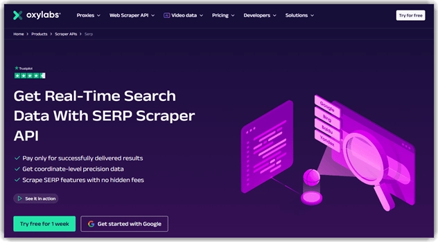
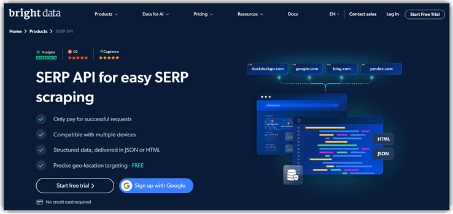
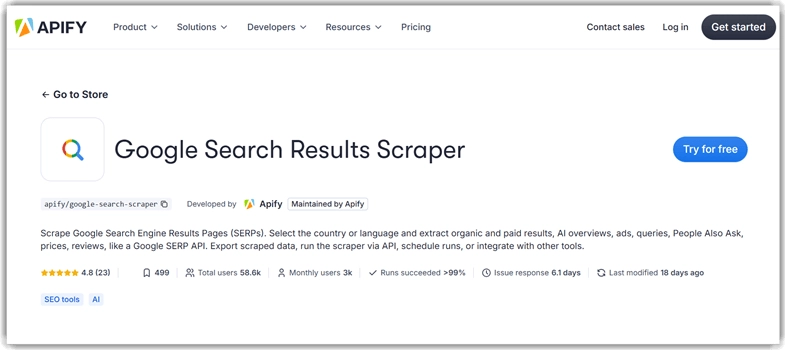
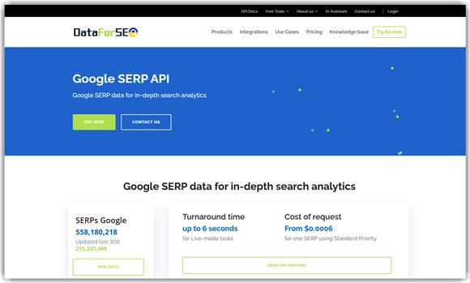
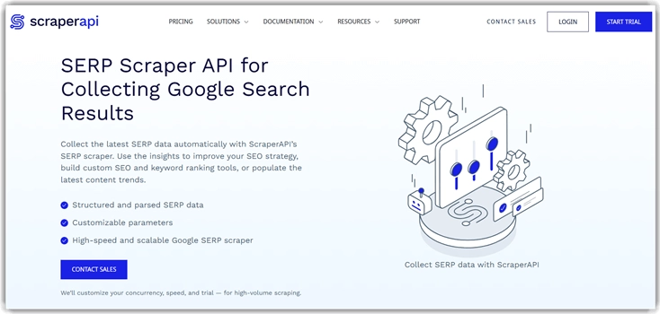

# 7款最佳Google SERP采集API工具（2025年）

想找一个能准确抓取数据的Google SERP采集API？也许你需要它来做生意、分析SEO、或者研究数据。但问题是，市面上工具太多了，随便选一个可能会让你掉坑里——数据不准、请求被封、解析出错、地理定位不行、响应慢、安全隐患、格式乱七八糟……

所以我花了120多个小时，测试了30多个知名的Google SERP采集API。最后筛出了7个真正靠谱的工具，都是我亲自用过的，没有任何水分。接下来，我会详细说说它们的功能、优缺点和价格，帮你做出明智的选择。

---

## 1) Oxylabs

Oxylabs的采集API能提供坐标级别的精准数据。最让我满意的是，我只需要为成功交付的结果付费。它能稳定地从Google收集数据,轻松绕过地理限制和反爬虫措施。

我能一次批量处理多达5000个URL，这对数据分析师来说简直完美。它提供的是结构化数据,省去了整理和清洗的麻烦。

**核心功能：**

- **高级位置定向：** Oxylabs特别适合需要针对特定地区受众的营销机构。它使用*uule*参数,不需要手动添加,直接通过API中的geo_location参数指定即可。
- **全类型结果支持：** 它支持所有类型的搜索结果抓取,让我印象深刻。我能轻松提取常规搜索结果、广告、各种图片、特色摘要等等。
- **自定义解析：** 这个功能对开发者和数据科学家很友好,便于集成和分析。它给我提供了结构化的JSON格式SERP数据,包括知识图谱、本地包等元素。
- **AI驱动助手：** 我可以用它自动生成解析指令和抓取请求的代码。因此我能得到即用代码,无需手动操作。不过在复杂场景下,你可能需要稍微干预一下。我遇到过一次它无法捕获某些解析逻辑的情况。
- **高度可扩展：** Oxylabs的Google采集API专为重度使用设计,因此也适合初创企业和大型公司。它能处理数百万次查询,每秒最多50个请求。

**定价方案：**

Oxylabs针对Google SERP采集API提供的月度套餐：

| Micro | Starter | Advanced |
|-------|---------|----------|
| $49   | $99     | $249     |

👉 [想要更稳定的数据采集体验？试试ScraperAPI的7天免费试用](https://www.scraperapi.com/?fp_ref=coupons)

---

## 2) Decodo

Decodo(前身是Smartproxy)有一个预构建的Google SERP采集API,能在任何规模下提供搜索引擎结果页数据。它还能绕过机器人检测,包含简便的代理管理。

我用它抓取了Google搜索、Google地图、购物、图片、价格、广告等等。SaaS开发者和需要依赖SERP构建应用的人可以用Decodo进行广泛的数据分析。

**主要特点：**

- **任务调度：** 它帮我提前安排Google SERP抓取任务,这样我就能专注做其他事。完成后我会收到邮件通知,简化了日常抓取工作。
- **灵活的输出选项：** 你可以选择JSON结果或原始HTML,随你喜欢。需要的时候我还能得到表格形式的解析结果。不过我注意到有一张表里有几个合并单元格。因此在高控场景下,我不得不用XPath进行自定义解析。
- **地理定向：** 你可以选择一个符合你需求的位置,获得实时个性化结果。这个功能对SEO分析、竞争情报和市场研究非常有用。
- **设备和浏览器自定义：** Decodo的采集API支持设备自定义,比如桌面和移动用户。它还允许浏览器设置,因此这些自定义能帮助模拟不同平台上的用户体验。
- **稳定性能：** 拥有超过1.25亿个IP和99.99%的正常运行时间,你可以放心抓取,避免IP被封和停机。它的平均响应速度是0.3秒,是市场上最快的提供商之一。

**价格：**

Decodo针对Google SERP采集API提供的最实惠月度核心套餐(含增值税)：

| 9万次请求 | 70万次请求 | 200万次请求 |
|----------|-----------|-----------|
| $29      | $99       | $249      |

**免费试用：** 7天试用(含14天退款保证)

---

## 3) Webshare

Webshare提供SEO代理来抓取SERP结果,专为SEO专业人士设计。它提供10个免费代理,所以如果你是自由职业者或做个人SEO研究,Webshare是个聪明的选择。

我不仅能抓取搜索引擎数据,还能追踪我网站在Google自然搜索中的表现。如果你需要日常使用的即时连接,它还提供免费的代理Chrome扩展。

**功能亮点：**

- **地理定向SEO：** 我能分析来自多个国家的本地SERP,为一个香水品牌进行可靠的市场研究。我的数据不受浏览位置影响,保证了准确性。
- **关键词研究：** Webshare的代理驱动Google SERP采集器能抓取关键词的自动建议。它还给我提供了摘要数据,比如"用户还问"等。
- **内容分析：** 你可以使用Webshare代理调查竞争对手的技术SEO和站内策略。尽管大多数网站都有反代理措施,但在我测试期间它都轻松绕过了。不过我不得不丢弃几个被封的IP,造成了一点小麻烦。
- **高速爬取：** 它提供来自领先数据中心的高级代理,带宽限制很高。因此你能获得更快的爬取速度,让你检查SEO问题并优化自然排名。
- **Google购物研究：** 我轻松抓取了竞争对手的公开Google购物数据。这让我分析了他们香水的定价策略,帮我通过更明智的销售决策保持竞争力。

**优点：**
- 提供专用网络带宽
- 支持HTTP和SOCKS5协议
- 99.97%的正常运行时间,可以持续抓取

**缺点：**
- 不支持某些区域位置

**价格：**

WebShare代理服务器计划的最低月度定价：

| 100个代理 | 1000个代理 | 5000个代理 |
|----------|-----------|-----------|
| $3.50    | $31.48    | $139.93   |

**免费试用：** 10个免费代理

---

## 4) Bright Data

Bright Data的SERP API设计用来模拟真实用户行为。它能轻松绕过CAPTCHA挑战,帮用户无干扰地访问搜索结果。这个API支持各种搜索类型,如文本、图片、新闻、地图和购物,并以JSON或HTML格式交付数据。

我对它的无缝集成和响应时间印象深刻,不到5秒。API一直为我提供准确全面的搜索数据,对我的SEO分析和竞争研究非常有用。

**功能：**

- **实时数据：** 它提供实时搜索引擎结果,确保你收到最新的可用数据。**SEO专业人士**寻找追踪自然关键词的工具可以使用这个采集API。
- **地理定向：** 我能利用Bright Data的SERP API进行城市级别的精确地理定向。因此它准确显示了特定区域的搜索结果是什么样的。这对针对特定地点的营销机构来说是个绝佳工具。
- **高级解析：** 我收到的是干净的、可操作的数据,可以直接存储并无缝插入应用和程序。这是因为它具有高级解析能力,能将原始HTML响应转换为结构化JSON数据。
- **广泛结果范围：** 这个SERP API通过模拟类似隐身浏览的场景来获取广泛的结果和广告。因此它帮我收集了Google广告、特色摘要、地图、视频等元素。它还模拟无cookie、无个性化、甚至无搜索历史的搜索,提供无偏见的结果。
- **支持图片搜索：** API模拟在Google上搜索图片并返回相似结果,提供相关信息。相关数据包括图片URL、替代文本、源页面URL、新闻等。因此它帮你监控**你的产品在Google上的排名**。不过我发现**缺少一些元数据**——要解决这个问题,你可以尝试通过**抓取**重新获取缺失的数据。

**价格：**

Bright Data针对其SERP API提供的最实惠套餐：

| 按需付费 | Growth(月付) | Business(月付) |
|---------|-------------|---------------|
| $1.5    | $1.27/千结果 | $1.12/千结果   |

**免费试用：** 7天试用

---

## 5) Apify

Apify是一个全栈采集平台,适合多种用例。我发现它非常适合市场研究,因为它能从Google SERP中出现的各种平台收集数据,比如评论网站。

它快速且易用的功能使它在电商SEO研究人员和独立创业者中很受欢迎。我必须承认Apify在绕过网站拦截器方面做得很出色。因此我轻松获得了Google上特定地理位置的内容访问权限,尽管在一些网站上我不得不重新尝试访问。

**特性：**

- **全面的SERP数据：** 它能捕获广泛的Google SERP元素。这些元素包括PAA、自然结果、付费广告、AI概览、产品广告、相关查询、评论等。因此我在使用Apify进行产品比较时收集了大量可靠数据。
- **自定义选项：** 它让你指定国家、语言和确切的地理位置参数。这让你能本地化搜索结果进行抓取。使联盟营销人员和本地SEO顾问能收集准确数据来分析搜索排名。
- **搜索查询限制：** 单个关键词最多可获得300个结果。因此我能检索多个准确数据,但不会被不必要的信息量压垮。它甚至帮我将搜索结果限制设置为100。
- **灵活的查询输入：** Apify的采集API接受搜索词和原始URL。因此我有灵活性来定义抓取目标,对数据的范围和粒度有更多控制。
- **反拦截：** 这个采集API包含反拦截功能,如自动轮换代理和随机用户代理生成。因此它显示类人浏览行为,并从不同IP显示分布式请求。

**优点：**
- 用户可以安排和监控抓取
- 你可以实时访问数据,无需等待抓取完成
- 数据可以导出为多种格式,如JSON、Excel、CSV和XML

**缺点：**
- 大规模抓取成本较高

**价格：**

Apify的Google搜索采集API月度套餐：

| Starter | Scale | Business |
|---------|-------|----------|
| $39     | $199  | $999     |

**免费试用：** 30天试用

---

## 6) DataforSEO

DataforSEO提供可靠的代理池和广泛的服务器基础设施来收集实时SERP数据。我能根据项目轻松扩展数据抓取。它的道德抓取方法和细粒度数据使其成为广泛使用的采集API。

DataforSEO的周转时间最多6秒,速度相当快,虽然不是市场上最快的。我还注意到它提供了Google结果页面和所有搜索元素最完整的概览之一。

**功能：**

- **专有代理网络：** 它可靠的代理网络确保失败请求最少、数据传输稳定并避免被封。我还发现它在大量数据抓取方面很可靠,适合数据记者和学术研究人员。
- **竞争对手分析：** 凭借其细粒度的Google SERP数据,你可以深入追踪竞争对手。我能查看哪个竞争对手针对哪个关键词排名、他们排名的频率等。因此帮你制定明智策略并识别内容缺口。
- **批量和任务调度：** 通过安排采集器,我能收集大量数据。无论你使用多少关键词,系统都能轻松扩展。不过如果你有复杂的请求,可能需要稍微手动干预。
- **反向链接分析：** 这个工具显示你目标的反向链接配置文件并提供深刻见解。它显示顶部页面、引用域等。这也让你加快项目的设计阶段,对开发者很有帮助。
- **声誉管理：** 它帮企业主和营销机构轻松追踪在线提及、监控客户评论和检查评分。实际上,我不仅能用它检查Google评论,还能检查Yelp评论。

**价格：**

DataforSEO针对SERP API提供的最低套餐(每页/每100个搜索结果)：

| 标准队列 (周转-5分钟) | 优先队列 (周转-1分钟) | 实时模式 (周转-6秒) |
|---------------------|---------------------|-------------------|
| $0.0006             | $0.0012             | $0.002            |

**免费试用：** 无限免费试用

---

## 7) ScraperAPI

ScraperAPI非常适合收集最新的SERP数据,因为它能用API自动收集。它让创业者、内容创作者和SEO研究人员改进SEO策略、构建自定义关键词排名工具并把握最新趋势。

我对它的抓取速度和收集的数据量印象深刻。它帮我绕过每个拦截系统来收集关于我网站排名和声誉的信息。虽然它提供99.9%的正常运行时间,但我在测试的第五天遇到了轻微停机,不过持续时间不长。

**核心功能：**

- **关键词监控：** 你可以几乎实时追踪关键词位置,帮你监控排名变化。这帮我用第一方数据衡量网站的SEO活动表现。
- **品牌监控：** 我能在几秒钟内从Google上出现的数千个博客和网站提取数据。因此品牌所有者可以用它监控业务表现并检查评论。
- **广告数据：** 它让你通过从关键词中提取广告数据来规划战略性广告活动。我能从文本广告中提取标题、显示URL、广告位置、描述等。对于购物广告,它提取了图片URL、产品标题、价格、商家名称等等。
- **高级SERP功能：** 它提供JSON自动解析、自动重试和JS渲染等功能。我还收到了反抓取绕过器、代理轮换、地理定向、CAPTCHA处理以及桌面和移动用户代理。
- **轻松添加数据：** 开发需要SERP数据的自定义SEO工具或应用的开发者可以轻松向这些项目添加新数据。我的开发团队能以自定义间隔收集SERP数据,并在无CAPTCHA和IP封锁的情况下接收流量增加的更新。

**价格：**

Scraper API提供的最低月度套餐：

| Hobby | Startup | Business |
|-------|---------|----------|
| $49   | $149    | $299     |

**免费试用：** 7天试用

---

## 如何克服Google SERP采集API的挑战

以下是克服Google SERP采集API挑战的最佳方法：

1. **挑战：有时Google会积极检测并拦截自动化查询。**  
   **解决方案：** 你应该选择内置代理轮换和CAPTCHA解决能力的采集API。住宅代理是Google SERP抓取的最佳代理类型,因为它们有助于避免快速重复请求。

2. **挑战：你可能无法获得不同国家或城市的准确本地SERP。**  
   **解决方案：** 在这种情况下,你必须选择支持地理特定搜索的API。我建议使用国家/语言参数,并尝试特定位置的代理或数据中心区域。

3. **挑战：Google SERP是动态的,所以它的模块不断演变,这些变化可能影响你的抓取。**  
   **解决方案：** 获取一个提供结构化JSON输出并自动更新所有新SERP类型的采集API。你还必须监控API更改日志并订阅更新通知。

4. **挑战：缺失摘要、不正确的排名位置或糟糕的解析可能导致错误的抓取决策。**  
   **解决方案：** 要克服这个问题,你应该对实时SERP进行定期数据验证测试。为了调试,选择返回完整HTML快照或视觉验证选项的API。

5. **挑战：一些API限制每分钟/每天的请求数,或可能对超额使用收费。**  
   **解决方案：** 建议通过查询批处理优化使用。频繁缓存访问的结果也会有所帮助。总的来说,我建议使用警报来保持在你的配额内。

6. **挑战：通过抓取搜索引擎,你可能违反服务条款或侵犯隐私法。**  
   **解决方案：** 始终选择强调道德抓取实践的供应商。提供商还必须遵守GDPR等法规。在为高风险用例大规模部署之前,确保咨询法律顾问。

---

## 其他抓取Google数据的方法

以下是不使用SERP API抓取Google数据的5种主要方法：

- **无头浏览器自动化** – 你可以使用Puppeteer或Playwright等工具模拟真实用户行为,收集动态内容。
- **带解析的手动HTTP请求** – 你可以尝试Requests + BeautifulSoup Python库来解析和提取HTML。因此原始代码被转换为解释的解析树。
- **通过CSE的Google搜索运算符**– 使用Google CSE(自定义搜索引擎),它合法地提供结构化搜索结果。
- **浏览器扩展抓取** – 借助Chrome扩展向页面注入JavaScript将允许你捕获页面上的搜索结果。
- **SERP截图 + OCR** – 只需截取搜索结果的屏幕截图,然后使用OCR工具(如Tesseract)。这将帮你提取所有可见数据。

---

## 最终建议

我在这篇文章中提到的所有Google SERP采集API都很可靠,尽管它们都有一些缺点。但在比较所有这些之后,我想推荐以下采集API。

如果你需要一个能在各种场景下稳定工作的工具,👉 [ScraperAPI是个不错的选择——它的7天免费试用让你零风险体验](https://www.scraperapi.com/?fp_ref=coupons)。无论是SEO研究、竞品分析还是市场调研,稳定的数据采集都是成功的第一步。
